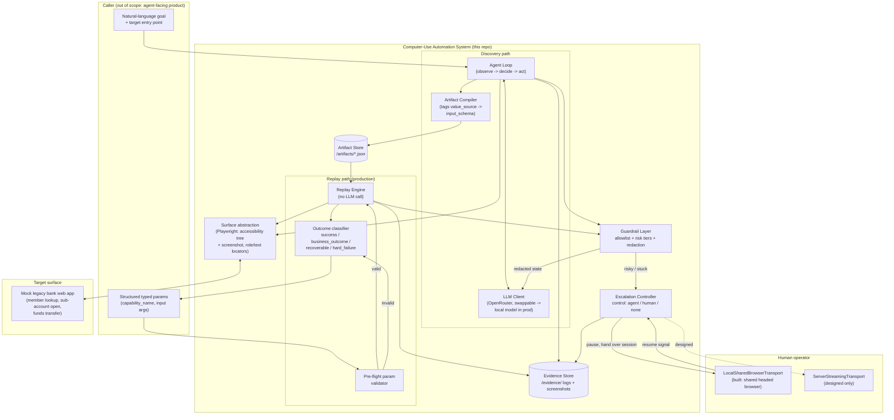

# Computer-Use Automation System

A system that uses an LLM to discover how to accomplish a goal by driving a live web
UI, records the successful run as a typed, versioned, reusable capability artifact,
and replays that artifact deterministically (no LLM in the decision loop) with typed
inputs/outputs, safety guardrails, and human-in-the-loop escalation.

Built for the interface.ai take-home assignment
(`Assignment A — Computer-Use Automation System.pdf`). Full design rationale is in
[REPORT.md](REPORT.md) (once written) and the design spec:
[docs/superpowers/specs/2026-08-17-computer-use-automation-design.md](docs/superpowers/specs/2026-08-17-computer-use-automation-design.md).

> **Status: design complete, implementation not yet started.** This README will be
> filled in with real setup/run instructions as the system is built.

## What this will do

1. Take a natural-language goal + target app.
2. Run an LLM-driven discovery agent that drives a real (mock, legacy-styled) bank
   back-office web app via Playwright, using an accessibility-tree + screenshot view
   of the page.
3. Record a successful run as a versioned JSON capability artifact (typed inputs,
   typed outputs, per-step locators and checkpoints).
4. Replay that artifact deterministically against new inputs, with no LLM call,
   detecting and classifying runtime outcomes (success / business outcome /
   recoverable / hard failure / validation error).
5. Escalate to a human and hand over the *same* live browser session when the agent or
   a replay run can't safely proceed on its own.
6. Enforce an allowlist, risk-tiered action handling, and redaction of sensitive data
   before it's sent to the LLM or persisted anywhere.

## System design



Read top to bottom: a **discovery** run (left path) takes a natural-language goal,
drives the mock app through the Surface abstraction, calls out to the LLM (through the
Guardrail's redaction pass) to decide each next action, and on success compiles the
step trace into a versioned artifact. A **replay** run (right path) takes a saved
artifact plus structured typed params, validates them up front, and executes the same
steps deterministically — no LLM call — classifying the result into one of four
outcome buckets. Both paths share the Guardrail layer (allowlist + risk tiers +
redaction), the Surface abstraction, and the Escalation Controller, which pauses
either loop and hands the *same* live browser to a human when something can't proceed
safely.

## Setup

_TBD once implementation begins._

## Demo path

_TBD once implementation begins — will be the exact command(s) to run the agent on a
goal, then replay the resulting artifact._

## Project layout (planned)

```
/mock_app/       legacy-styled Flask target application
/agent/          discovery agent (observe -> decide -> act loop)
/replay/         deterministic replay engine
/artifacts/      saved capability artifacts (JSON)
/evidence/       logs + screenshots from discovery and replay runs
/docs/           design spec(s)
REPORT.md        design write-up (architecture, schema, determinism, etc.)
```
