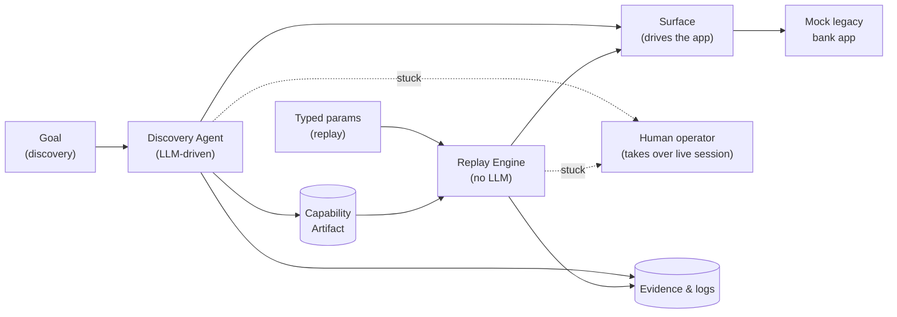
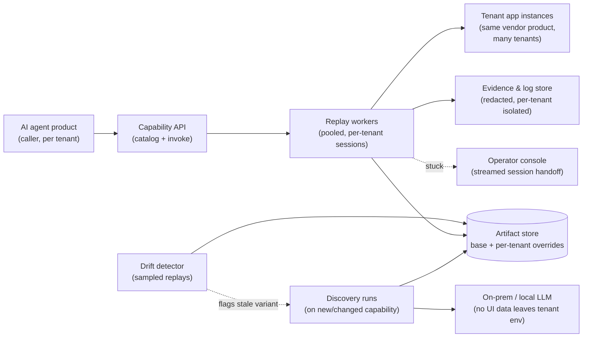

# Computer-Use Automation System

A system that uses an LLM to discover how to accomplish a goal by driving a live web
UI, records the successful run as a typed, versioned, reusable capability artifact,
and replays that artifact deterministically (no LLM in the decision loop) with typed
inputs/outputs, safety guardrails, and human-in-the-loop escalation.

Built for the interface.ai take-home assignment
(`Assignment A — Computer-Use Automation System.pdf`). Full design rationale is in
[REPORT.md](REPORT.md) (once written) and the design spec:
[docs/superpowers/specs/2026-08-17-computer-use-automation-design.md](docs/superpowers/specs/2026-08-17-computer-use-automation-design.md).

> **Status: design complete, implementation not yet started.** This README will be
> filled in with real setup/run instructions as the system is built.

## What this will do

1. Take a natural-language goal + target app.
2. Run an LLM-driven discovery agent that drives a real (mock, legacy-styled) bank
   back-office web app via Playwright, using an accessibility-tree + screenshot view
   of the page.
3. Record a successful run as a versioned JSON capability artifact (typed inputs,
   typed outputs, per-step locators and checkpoints).
4. Replay that artifact deterministically against new inputs, with no LLM call,
   detecting and classifying runtime outcomes (success / business outcome /
   recoverable / hard failure / validation error).
5. Escalate to a human and hand over the *same* live browser session when the agent or
   a replay run can't safely proceed on its own.
6. Enforce an allowlist, risk-tiered action handling, and redaction of sensitive data
   before it's sent to the LLM or persisted anywhere.

## System design



A **discovery** run takes a natural-language goal, uses an LLM to drive the mock app
through the Surface, and on success saves a reusable **capability artifact**. A
**replay** run takes that artifact plus typed params and re-runs it deterministically
— no LLM involved — through the same Surface. Either path can hand control of the
live session to a **human operator** if it gets stuck, and both leave an evidence
trail behind. (Guardrails — allowlisting, risk tiers, redaction — apply throughout
but are omitted here for readability; see the design spec for the full picture.)

## Production-scale design (not built — see [Cuts](docs/superpowers/specs/2026-08-17-computer-use-automation-design.md#11-cuts-explicit-for-reportmd-7))

This repo implements a single-tenant, single-process version. At the scale described
in the assignment (hundreds of tenants, ~20 apps each, many sharing the same vendor
product), the same core components would be pulled out into services:



Key differences from the built version:

- **Discovery becomes rare, replay becomes the hot path.** Most traffic is capability
  *invocation* (replay) triggered by the AI agent product through a capability API;
  discovery only runs when a capability is first created or flagged as drifted.
- **One base artifact per vendor app, with per-tenant overrides** — not one recording
  per tenant. The artifact store holds a base artifact plus a sparse
  `variant_overrides` diff per tenant (see spec §9), so onboarding a new tenant on an
  already-known vendor product doesn't require re-recording from scratch.
- **On-prem/local LLM for discovery** — since discovery is the only path that talks to
  an LLM at all, and this is regulated financial data, discovery would run against a
  locally-hosted model rather than a third-party API in production (see spec §8).
- **A real operator console** replaces the local shared-browser handoff — a streamed
  session (the `ServerStreamingTransport` designed in spec §7) so an operator can be
  anywhere, not sitting at the machine running the browser.
- **A drift detector** periodically samples replays per tenant/variant and flags an
  artifact for re-discovery when its checkpoints stop resolving, rather than someone
  finding out via a production failure.

Per the assignment's own guidance, none of this is built — designing the abstractions
so they *could* scale this way (the `Surface` interface, canonicalized locators,
`ControlTransport`, the four-bucket outcome taxonomy) is the actual deliverable; the
services/queues/pooling above are not.

## Setup

_TBD once implementation begins._

## Demo path

_TBD once implementation begins — will be the exact command(s) to run the agent on a
goal, then replay the resulting artifact._

## Project layout (planned)

```
/mock_app/       legacy-styled Flask target application
/agent/          discovery agent (observe -> decide -> act loop)
/replay/         deterministic replay engine
/artifacts/      saved capability artifacts (JSON)
/evidence/       logs + screenshots from discovery and replay runs
/docs/           design spec(s)
REPORT.md        design write-up (architecture, schema, determinism, etc.)
```
